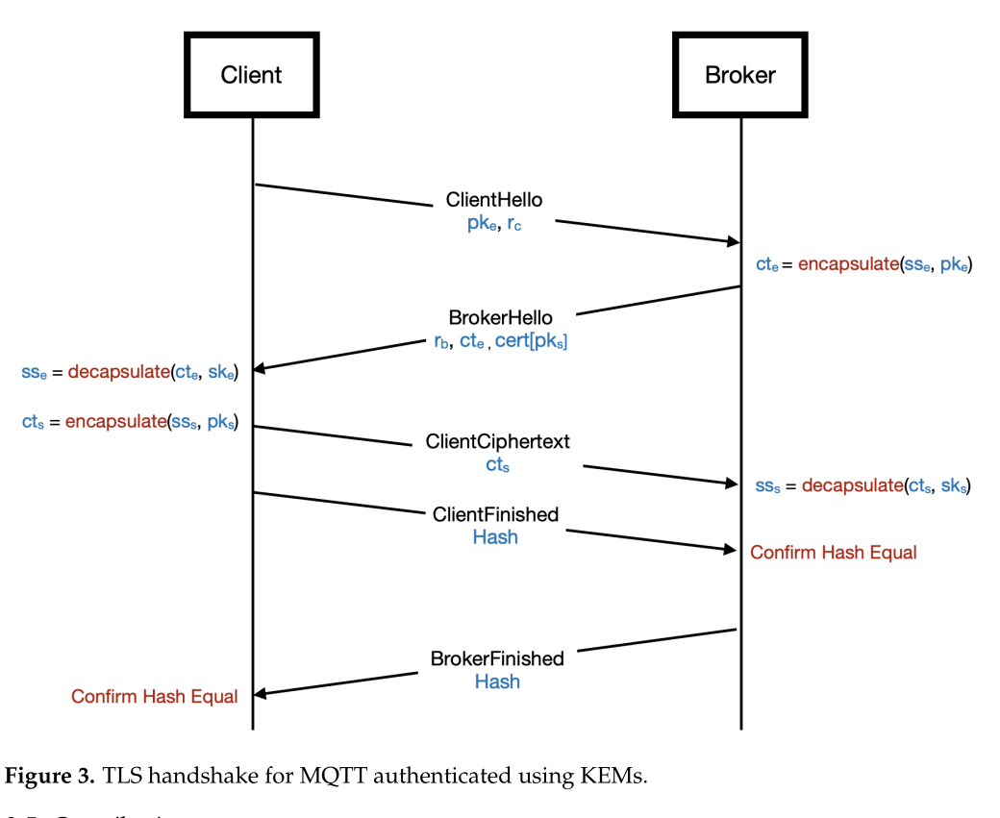

# Understanding the Gritti 2023 Handshake (Figure 3)

## Source
The following diagram is taken directly from Gritti & Samandari (2023), 
*"Post-Quantum Authentication in the MQTT Protocol"*, Figure 3.

## Pre-coding analysis

**Who generates `pke` and `ske` ?**

In the set-up phase, the client starts by generating an ephemeral key pair consisting of a public key `pke` and a secret key `ske` using the Kyber algorithm. A random nonce `rc` is also generated independently at this stage.

---

**What does the `ClientHello` message contain ?**

The `ClientHello` message contains two elements : the ephemeral public key `pke` and the random nonce `rc`. For the purpose of this prototype, no additional fields are required.

---

**What does the broker do when it receives `pke` ?**

Upon receiving `pke`, the broker uses it to encapsulate an ephemeral shared secret `ss_e`. This operation produces a ciphertext `ct_e`, which is sent back to the client. The broker retains `ss_e` locally and never transmits it directly.

---

**What is `ss_e` and who knows it at the end ?**

`ss_e` is the ephemeral shared secret established at the beginning of the handshake. It is generated by the broker during encapsulation and recovered by the client through decapsulation using `ske`. At the end of the handshake, both the client and the broker hold `ss_e`. It is then combined with `ss_s` to derive the final session key.

---

**What is `ss_s` and who knows it at the end ?**

`ss_s` is the static shared secret, which plays a central role in broker authentication. The client encapsulates it using the broker's long-term public key `pks` and sends the resulting ciphertext `ct_s`. Only the legitimate broker, holding the corresponding secret key `sks`, can recover `ss_s` through decapsulation. Authentication is not verified at the decapsulation step itself, but rather through the HMAC verification that follows : if the broker holds the correct `ss_s`, it can compute the expected HMAC ; otherwise, verification fails.

---

**What is the role of HMAC at the end ?**

HMAC, which stands for Hash-based Message Authentication Code, serves as the final confirmation step of the handshake. Each party independently computes `HMAC(final_key, all_previous_messages)` and sends the result to the other. If both values match, it confirms that the two parties have exchanged the same messages and derived the same session key, meaning the handshake completed successfully on both sides.

---

